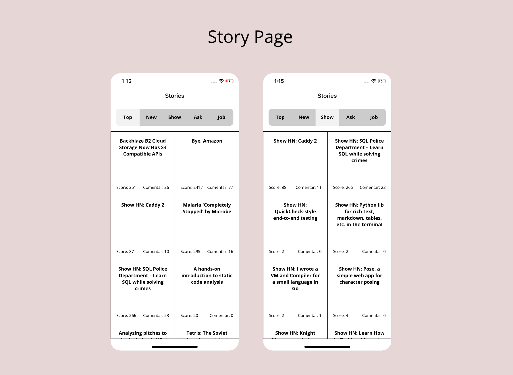
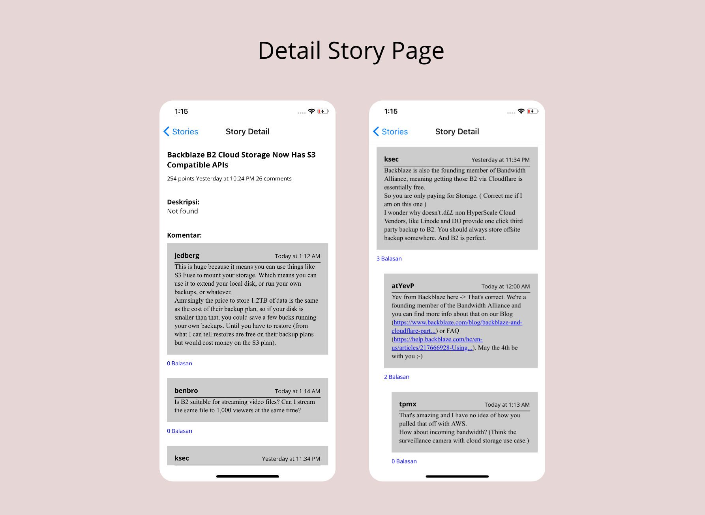

# React Native X Hacker News API

## What we use: 

1. React Hooks

2. React Navigation

3. Axios for fetch data

4. WebView auto-resize (free to use)

5. My Boilerplate

6. Refresh data scroll down

7. List Pagination (load more)

## Screenshots

## Repo React: 

https://github.com/silogos/ReactNative-HackerNewsAPI

## Hacker News API:

https://github.com/HackerNews/API

## Requirements

Node 10 or greater is required. Development for iOS requires a Mac and Xcode 9 or up, and will target iOS 9 and up.

You also need to install the dependencies required by React Native: [https://reactnative.dev/docs/environment-setup](https://reactnative.dev/docs/environment-setup)

## Running the project

Assuming you have all the requirements installed, you can setup and run the project by running:

- clone this repository
- `npm install --save` to install the dependencies
- run the following steps for your platform

### Android

- only the first time you run the project, you need to generate a debug key with:
  - `cd android/app`
  - `keytool -genkey -v -keystore debug.keystore -storepass android -alias androiddebugkey -keypass android -keyalg RSA -keysize 2048 -validity 10000`
  - `cd ../..` to come back to the root folder
- `npx run react-native start` to start the metro bundler, in a dedicated terminal
- `npx run react-native run-android` to run the Android application (remember to start a simulator or connect an Android phone)

### iOS

- `cd ios`
- `pod install` to install pod dependencies
- `cd ..` to come back to the root folder
- `npx run react-native start` to start the metro bundler, in a dedicated terminal
- `npx run react-native run-ios` to run the iOS application (remember to start a simulator or connect an iPhone phone)